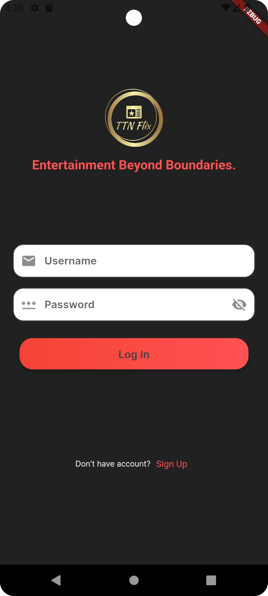
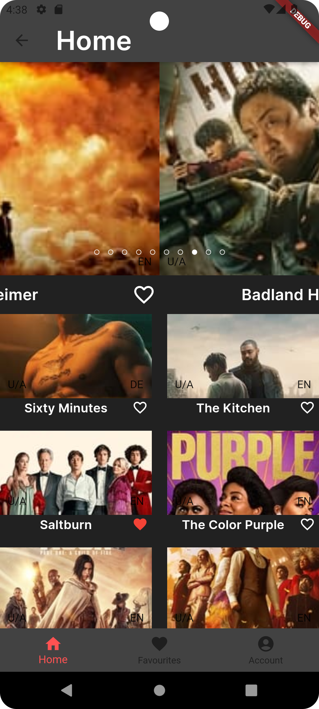
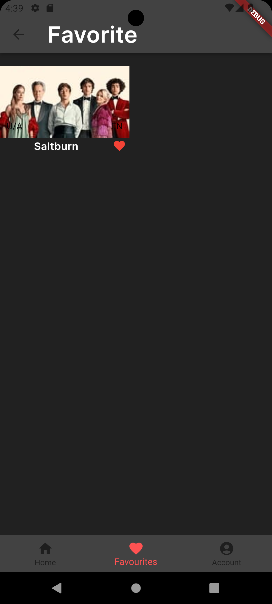
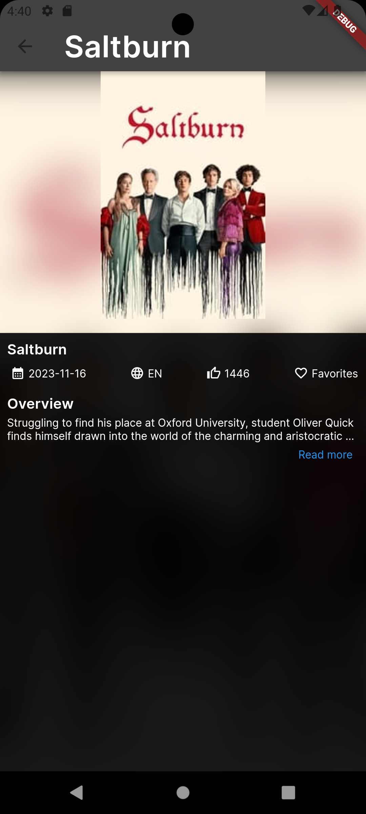
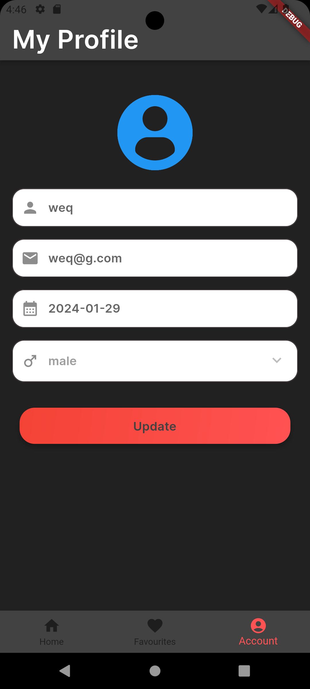

# ttn_flix

A new Flutter project with an OTT application where it shows the available movies and performs other functions.

## Getting Started

This project is a starting point for a Flutter application.

### Prerequisites

List any software, tools, or dependencies that need to be installed before your Flutter project can be run.

- [Flutter](https://flutter.dev/docs/get-started/install)
- [Dart](https://dart.dev/get-dart)
### Installation

Provide step-by-step instructions on how to install and set up your Flutter project.

# Clone the repository
git clone https://github.com/AM5324/ttnflix.git

# Navigate to the project folder
cd your-flutter-project
lib/
├── data/
│   └── models
    |── network
        └── api
        └── helper
    └── repositories
├── logic/
│   └── home.dart
└── presentation
├── main.dart
└── ...

# Get dependencies
flutter pub get
flutter pub run build_runner build

# ScreenShot 

t
